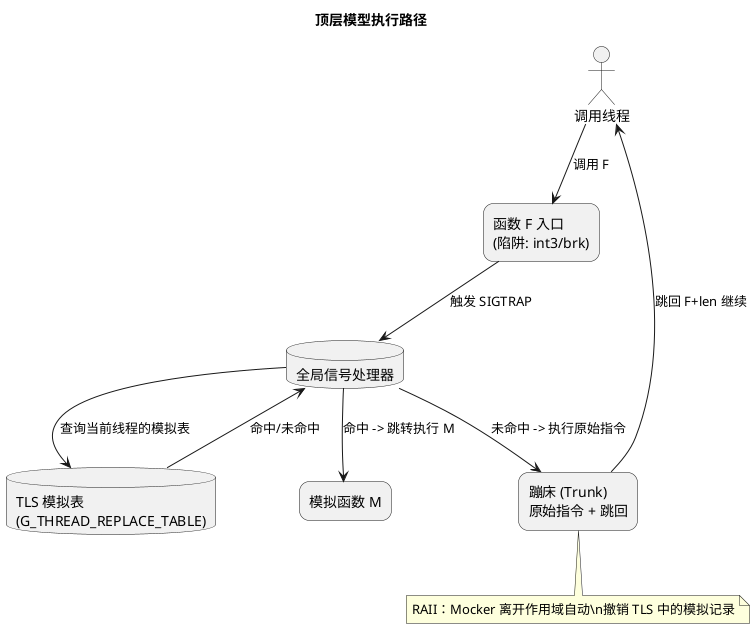
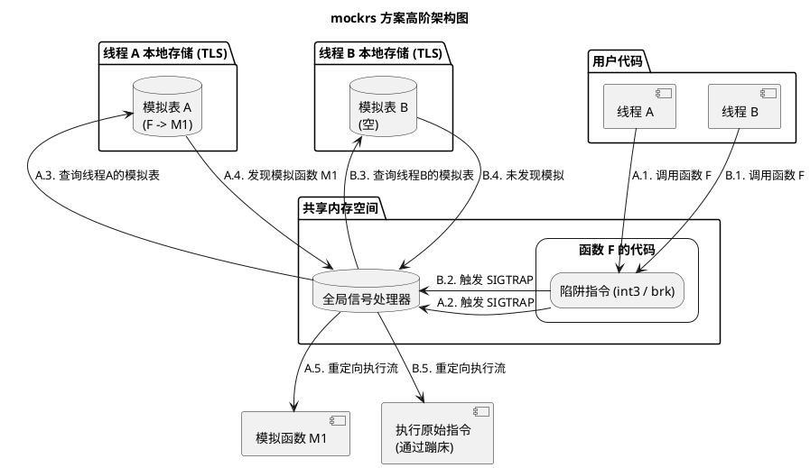
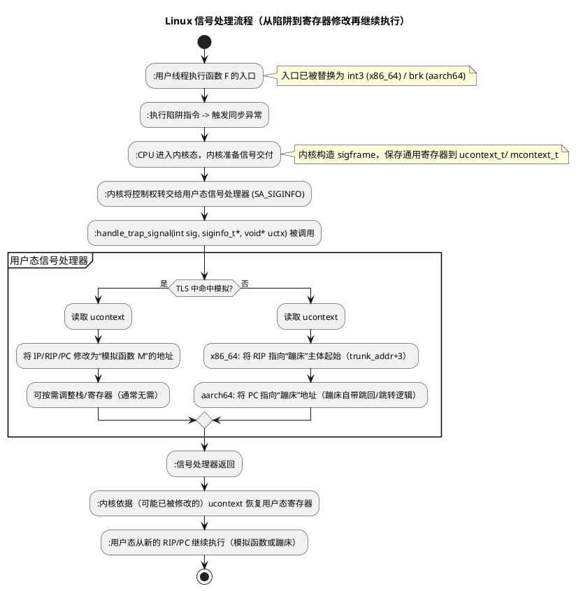
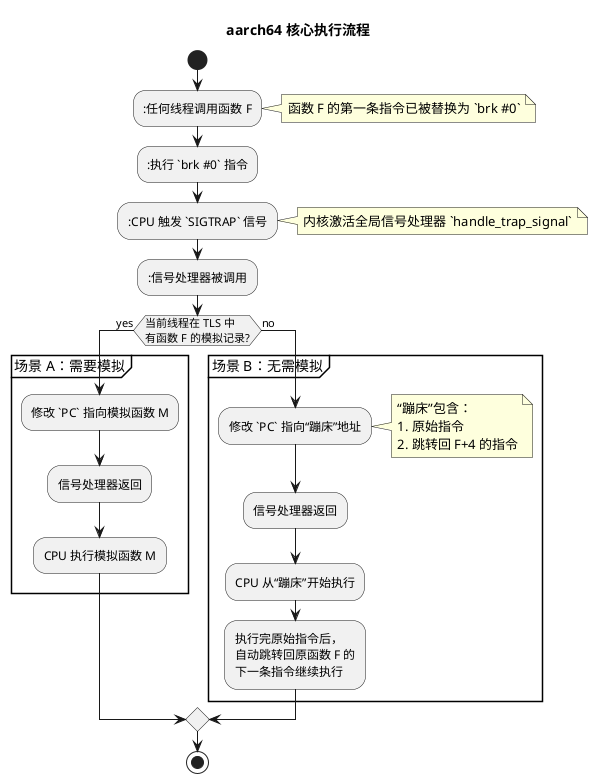
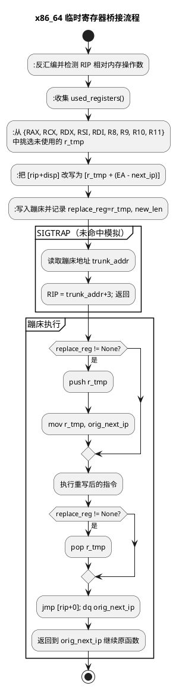

# `mockrs` — 超越 Trait 的自由函数模拟与线程安全

摘要

mockrs 通过在运行时修改函数入口机器码并结合信号处理与线程本地存储（TLS），实现对任意函数（自由函数、具体方法、FFI 函数）的精确模拟，并在多线程环境中提供严格的线程隔离。相较传统基于 Trait 的模拟库，mockrs 不需要对生产代码进行接口化重构，适合集成测试与复杂边界场景。本文系统阐述问题背景、设计目标、顶层模型与可行性、关键方案、实现细节、跨架构差异、工程化与测试、效果评估以及局限与展望。

---

## 1. 引言

### 1.1 背景与动机

在 Rust 生态中，测试是构建可靠软件的基石。传统模拟库（如 mockall）功能强大，但几乎都基于 Trait 工作：开发者需要先定义 Trait，再生成模拟实现并通过依赖注入在测试时使用。这一模式鼓励面向接口编程，但也带来如下局限：
- 无法模拟自由函数（fn my_func(...)）
- 无法模拟外部依赖的具体实现（未通过 Trait 暴露）
- 为可测试性引入不必要的设计约束（重构成本高）
- 难以处理 FFI 函数

### 1.2 问题陈述

目标是在不修改被测代码设计的前提下，能够在运行时对任意函数进行拦截与替换；并且在多线程场景中，确保仅对指定线程生效，其他线程无感。

### 1.3 目标与非目标

- 目标：
  - 任意函数模拟（自由函数、具体方法、FFI）
  - 线程隔离（仅影响当前线程）
  - 易用性（提供 mock! 宏）
  - 跨架构支持（x86_64 与 aarch64）
  - RAII（作用域结束自动恢复）
- 非目标：
  - 性能极致优化的热点路径替换（每次调用都会引发信号）

### 1.4 快速上手

- 依赖与导入：use mockrs::mock;
- 基本用法：传入原函数与模拟函数的名称，返回的 Mocker 在当前线程内生效，离开作用域自动恢复。

示例：
```rust
use mockrs::mock;

fn add(a: i64, b: i64) -> i64 { a + b }
fn mock_add(_a: i64, _b: i64) -> i64 { 100 }

fn main() {
    assert_eq!(add(1, 2), 3);

    // 在当前线程内，将 add 替换为 mock_add
    let mocker = mock!(add, mock_add);
    assert_eq!(add(1, 2), 100);

    // 作用域结束或手动 drop 后恢复
    drop(mocker);
    assert_eq!(add(1, 2), 3);
}
```

- 线程隔离：mock! 仅对创建它的线程生效。其他线程调用原函数不受影响。
- 小贴士：模拟函数的签名需与原函数一致（参数与返回值一致）。

---

## 2. 顶层模型与可行性

### 2.1 核心思路

mockrs 不在类型系统层面做替换，而是在运行时直接对函数入口的机器码做最小篡改：将第一条指令替换为陷阱指令（x86_64 上的 int3，aarch64 上的 brk）。任何线程执行到此处都会触发 SIGTRAP，由全局信号处理器接管执行流；随后根据“线程本地模拟表（TLS）”决定是跳转到模拟函数，还是执行被备份到“蹦床（Trampoline/Trunk）”中的原始指令并精确恢复。

### 2.2 顶层模型

- 全局提问：陷阱指令 + 全局信号处理器捕捉 SIGTRAP
- 线程本地回答：TLS 中的 G_THREAD_REPLACE_TABLE 决定本线程是否模拟以及跳转目标
- 蹦床（Trampoline；与实现中的变量命名保持一致，文中也称 Trunk）：备份原始指令（必要时重写以修复 PC 相对寻址），并在必要时带跳回序列
- RAII：Mocker 生命周期结束时撤销当前线程的模拟记录

顶层模型示意图：


### 2.3 高阶架构图



### 2.4 设计原则

- 最小侵入：仅修改函数入口处字节
- 可证恢复：未模拟线程路径具备确定性和可验证的恢复流程
- 架构适配：针对 x86_64 与 aarch64 的指令集特性分别采用最稳健机制
- 工程可用：提供 CI 与 aarch64 交叉测试保障

### 2.5 Linux 信号处理与寄存器修改可行性

利用 Linux 的信号处理机制（sigaction + SA_SIGINFO），用户态信号处理器可在接收 SIGTRAP 时直接读取并修改 ucontext_t 中保存的寄存器快照（如 x86_64 的 RIP/EFLAGS、aarch64 的 PC/X 寄存器）。当信号处理器返回时，内核依据该上下文恢复用户态寄存器，因而“修改后的寄存器值立即生效”，从而实现执行流重定向。这一机制是 mockrs 基于陷阱指令在用户态完成“跳转到模拟函数”或“切入蹦床”的可行性根基。

信号处理总流程（从陷阱到恢复）：


关键事实（可行性证明）：
- 用户可写的寄存器上下文：使用 sigaction 注册 SA_SIGINFO 处理器后，第三个参数为 void*，在 glibc 下可转为 ucontext_t*。通过 uc_mcontext 可直接读写通用寄存器与标志位：
  - x86_64：如 gregs[REG_RIP]、gregs[REG_EFL]（EFLAGS），可将 RIP 改为模拟函数地址。
  - aarch64：如 uc_mcontext.pc、uc_mcontext.regs[Xn]，可将 PC 改为蹦床/模拟函数地址；按需使用 X17 作为跳转寄存器。
- 修改当次返回点：信号处理器返回后，内核按 sigframe 恢复寄存器；因此“在处理器返回用户态前修改寄存器”即可无 syscalls 地改变后续执行流，确保低开销与确定性。
- 线程隔离天然成立：信号由触发陷阱的“当前线程”接收与处理，结合 TLS 决策，仅影响当前线程；其他线程即使执行同一函数，也会独立经由各自的 TLS 与处理器路径。
- 工程建议：
  - 使用 sigaction(..., SA_SIGINFO | SA_RESTART | SA_ONSTACK, ...) 提升健壮性；可在高栈消耗场景配置 sigaltstack 作为信号栈。
  - 仅在测试/开发环境使用该机制（涉及 RWX 与自修改代码）；aarch64 需在写入后执行 dsb sy + ic ivau + isb 刷新 I-Cache。

---

## 3. 与 Trait 模拟的差异与动机细化

### 3.1 差异对比

| 维度 | Trait 模拟 | mockrs |
| --- | --- | --- |
| 改造成本 | 常需为可测试性重构生产代码（抽象接口、依赖注入）。 | 直接作用于已存在的自由函数/具体实现，无需为测试重构设计。 |
| 可模拟对象 | 以接口为中心，难以覆盖自由函数与部分 FFI。 | 自由函数、具体方法、FFI 均可（前提是有可寻址入口）。 |
| 线程隔离 | 通常为进程级替换，难以自然隔离线程。 | TLS 驱动的线程级生效，天然支持并发测试的相互独立。 |
| API 复杂度 | 需要定义/实现 Trait，配置期望与行为。 | 一个 mock! 宏即可完成替换，RAII 自动恢复。 |
| 典型场景 | 单元测试、面向接口的业务逻辑隔离。 | 集成测试、边界条件/自由函数/FFI/系统调用包装等难以接口化的路径。 |

### 3.2 具体局限性示例：为什么仅有 Trait Mock 与非线程独立 Mock 不够

#### 3.2.1 基于 Trait 的 Mock 的局限性（示例）

- 场景 A：自由函数/FFI 难以通过接口注入
  - 现状：许多现存代码直接调用自由函数或 FFI，例如 std::fs::read_to_string、libc::gettimeofday/clock_gettime、自定义 util::now() 等。
  - 典型业务代码：
    ```rust
    mod lib {
        pub fn read_token() -> String {
            std::fs::read_to_string("/secure/token").unwrap()
        }
    }

    pub fn business() -> bool {
        let t = lib::read_token();
        t.trim() == "prod"
    }
    ```
  - 若用 Trait Mock，需要为可测试性重写设计，引入接口与依赖注入：
    ```rust
    pub trait TokenReader {
        fn read_token(&self) -> String;
    }

    pub struct Real;
    impl TokenReader for Real {
        fn read_token(&self) -> String {
            std::fs::read_to_string("/secure/token").unwrap()
        }
    }

    pub fn business<R: TokenReader>(r: &R) -> bool {
        let t = r.read_token();
        t.trim() == "prod"
    }
    ```
  - 问题：
    - 扩散式改动：business 的签名变化会沿调用栈层层传递，影响大量文件与模块。
    - 第三方/FFI 不可控：对于外部 crate 或 C 接口，无法强制其改为 Trait 暴露，更无法修改其调用点。
    - API 稳定性受损：为了测试引入的 Trait/泛型约束，改变了对外 API 与类型边界，增加维护复杂度。
    - 设计被测试绑架：把“可测试性”要求强加到生产代码，违背最小侵入原则。

- 场景 B：静态/关联函数、具体实现难以抽象
  - 例如某具体类型的关联函数 T::connect() 或全局初始化函数 init_logging()，若非预先以 Trait 抽象，事后很难安全地改为依赖注入；即便能改，也需要跨层接口调整与生命周期/Send/Sync 约束处理，成本与风险都很高。

- mockrs 的解法：
  - 直接在运行时替换这些自由函数/具体实现的入口，无需改动被测代码设计；测试结束自动恢复，保持生产代码纯净。

#### 3.2.2 非线程独立的 Mock 的局限性（以 mockcpp 为例）

- 背景：传统 C/C++ 打桩方案（以 mockcpp 等为代表）常通过对全局符号的进程级替换来实现自由函数模拟。这类替换通常是“全局生效”的：一旦设桩，整个进程内所有线程都会看到被替换后的行为。

- 并发下的典型问题（伪代码示例，展示现象而非特定 API）：
  ```cpp
  // 真实实现：f() 返回 0
  int f();

  // 线程 A 希望把 f() 桩成返回 1
  void threadA() {
      set_global_stub(f, [](){ return 1; }); // 进程级生效
      EXPECT_EQ(f(), 1);                      // 通过
      std::this_thread::sleep_for(std::chrono::milliseconds(50));
      clear_global_stub(f);
  }

  // 线程 B 希望调用真实 f()
  void threadB() {
      // 期望：真实行为
      EXPECT_EQ(f(), 0);                      // 可能失败：被 A 的全局桩污染
  }

  int main() {
      std::thread A(threadA);
      std::thread B(threadB);
      A.join(); B.join();
  }
  ```
  - 现象：
    - 污染：线程 B 在 A 的桩有效期间也会命中桩，预期与实际不一致。
    - 竞态：若 B 在 A 清桩的同时执行 f()，可能出现未定义行为或间歇性失败。
    - 难以并行：为了避免互相污染，只能串行化测试或使用复杂同步，降低测试吞吐量。

- mockcpp 一类“进程级打桩”方案的局限性总结：
  - 缺乏线程隔离：替换范围是进程级而非线程级，不能满足“同进程多场景并行”的测试需求。
  - 全局状态竞争：桩的安装/卸载与被测代码的多线程调用相互交织，容易产生数据竞争与时序问题。
  - 复杂的用例下难以维护：需要额外同步与测试编排来规避污染，成本高且脆弱。

- mockrs 的对照优势：
  - 替换记录保存在 TLS，仅对创建桩的线程生效；其他线程走“蹦床 + 恢复”路径，始终执行真实实现。
  - 无需跨线程同步与封锁即可并行跑不同场景的测试；RAII 生命周期自动恢复，降低误用概率。

---

## 4. 关键挑战与解决方案

我们面临五个关键问题：权限（可写）、劫持（拦截执行流）、隔离（线程粒度生效）、重定位（PC 相对修复）、恢复（精确跳回）。以下给出整体解法。

### 4.1 权限与劫持：mprotect + 陷阱指令

- 使用 nix::mprotect 在运行时将目标页权限临时改为 RWX
- 在函数入口写入陷阱指令（x86_64 上的 int3，aarch64 上的 brk）
- 将被覆盖的第一条原始指令备份到“蹦床”

### 4.2 执行路径分发与线程隔离

- 全局信号处理器根据 TLS 判定：有模拟则重定向至新函数，无则执行蹦床中的原始指令

### 4.3 精确恢复：一次 SIGTRAP + 自包含蹦床（x86_64 / aarch64）

- x86_64：不再依赖单步。未命中模拟时，信号处理器将 RIP 设为蹦床主体起始（trunk_addr+3）。蹦床根据指令类型：
  - 非分支：执行（可能经重写的）原始指令，随后使用 jmp [rip+0] + 8 字节字面量的绝对跳回至 orig+len。
  - 分支（相对 CALL/JMP/Jcc）：改写为间接绝对调用/跳转：
    • CALL: `CALL [RIP+0]; JMP +8; dq target_abs`（返回后继续执行蹦床尾部并回跳到 orig+len）
    • JMP: `JMP [RIP+0]; dq target_abs`（不追加回跳，控制流直接离开）
    • Jcc: `Jcc.inv +14; JMP [RIP+0]; dq target_abs` (使用反向条件跳过绝对跳转，并在fall-through时执行蹦床尾部回跳)
- aarch64：一次 SIGTRAP，蹦床自带“指令 + 回跳/跳转”序列，语义等价。

### 4.4 重定位（指令重写）

- x86_64：iced-x86 识别 RIP 相对寻址，挑选未使用的 caller-saved 寄存器作为“桥接寄存器”，并在蹦床中通过 `push/mov/pop` 序列完成寄存器准备与恢复。
- aarch64：对 B/BL 等分支生成“LDR X17, #8; BR/BLR X17; <绝对地址>”；对 ADRP/ADR 在蹦床 PC 重编码或回退到“字面量装载 + 跳转/使用”；必要时对 literal LDR 采用保守序列避免 SIGILL

---

## 5. 执行流程总览与细化

### 5.1 x86_64 核心执行流程

```plantuml
@startuml
title x86_64 核心执行流程（一次 SIGTRAP + 自包含蹦床）

start
::任何线程调用函数 F;
note right: 函数 F 的第一条指令已被替换为 `int3` (0xCC)

::执行 `int3` 指令;
::CPU 触发 `SIGTRAP` 信号;
note right: 内核激活全局信号处理器 `handle_trap_signal`

::信号处理器被调用;
if (当前线程在 TLS 中\n有函数 F 的模拟记录?) then (yes)
  partition "场景 A：需要模拟" {
    :修改 `RIP` 指向模拟函数 M;
    :信号处理器返回;
    :CPU 执行模拟函数 M;
  }
else (no)
  partition "场景 B：无需模拟" {
    :读取蹦床地址 `trunk_addr`;
    :将 `RIP = trunk_addr + 3`（跳过3字节头）;
    :信号处理器返回;
    :CPU 从蹦床主体开始执行;
    if (原始首条是“非分支”) then (是)
      :执行（可能经重写的）原始指令;
      :执行蹦床尾部 `jmp [rip+0]; dq (orig+len)` 回到原函数下一条;
    else (为“相对分支”) 
      if (CALL) then (CALL)
        :执行 `CALL [rip+0]; JMP +8; dq target_abs`;
        :从被调函数返回后继续执行蹦床尾部并 `jmp` 回 orig+len;
      else (JMP)
        :执行 `JMP [rip+0]; dq target_abs` 并直接离开蹦床;
      else (Jcc)
        :执行 `Jcc.inv` / `JMP` 序列;
        :根据条件跳转或 fall-through 到蹦床尾部并 `jmp` 回 orig+len;
      endif
    endif
  }
endif
stop

@enduml
```

#### 5.1.1 分支处理

- 已支持的相对分支改写：
  - **CALL (rel32):** -> `CALL [RIP+0]; JMP +8; dq target_abs`（返回后，短跳过8字节地址，继续执行蹦床尾部的回跳序列，返回到 `orig+len`）
  - **JMP (短/近):** -> `JMP [RIP+0]; dq target_abs`（不追加回跳，控制流直接离开）
  - **Jcc (条件分支):** -> `Jcc.inv +14; JMP [RIP+0]; dq target_abs`。使用反向条件的短跳转，在条件不满足时跳过14字节的绝对跳转指令体；若条件满足，则执行绝对跳转。蹦床尾部仍包含回跳序列，用于原始 Jcc 不跳转时的 fall-through 路径。

### 5.2 aarch64 核心执行流程



#### 5.2.1 为什么 aarch64 没有单步/写回抑制机制？是否不需要？

- 设计选择：aarch64 路径采用“一次 SIGTRAP + 自包含蹦床”的确定性流程，不依赖单步。信号处理器只负责把 PC 指向蹦床：
  - 若首条是分支（B/BL/B.cond 等）：在 save_old_instruction 的分支处理路径中，会将相对分支重写为“LDR X17, #8; BR/BLR X17; <绝对目标地址>”，直接跳向真实目标，不再返回原函数入口。这等价于 x86_64 中“RIP 已被改写则不写回”的效果，但由蹦床自身保证，无需在信号返回时再做判断。
  - 若首条为非分支：蹦床末尾固定附加“LDR Xt, #8; BR Xt; <orig+len>”的跳回序列，执行完原始/重写指令后自动回到 orig+len 继续，无需第二次 SIGTRAP。
- 为什么不实现单步：
  - 可用性与复杂度：x86_64 通过 EFLAGS.TF 可直接进入单步；aarch64 的单步需要操作调试状态（如 PSTATE.SS/调试寄存器）并通常经由 ptrace 等机制，在信号处理器内启停不如 x86 简便、可移植。
  - ISA 特性：aarch64 指令定长 4 字节，易于在蹦床中构造“绝对跳转/跳回”序列；相对分支与 PC 相对访问可以在蹦床处重编码或改为“装载绝对地址 + 间接跳转/使用”，因此无需依赖单步去“原位执行”。
  - 稳健性与兼容：一次 SIGTRAP 避免两次陷阱带来的时序/嵌套信号问题；在 QEMU 等仿真环境更稳定。实现中也配套执行 I-Cache 刷新，保证自修改代码一致性。
  - 性能：单次陷阱比两次陷阱更低开销。
- 是否不需要：是。由于蹦床已分别对“分支”和“非分支”路径提供了精确的前进/回跳语义，aarch64 不需要在信号返回时做“写回抑制”判断；控制流转移由蹦床指令序列直接体现。

---

## 6. 平台差异与原因

### 6.1 x86_64 与 aarch64 的差异（概览）

- 入口陷阱：int3（1B） vs brk（4B）
- 未模拟路径：两者均为一次 SIGTRAP + 自包含蹦床（原始/重写指令 + 回跳或直达分支目标）
- 蹦床组织：x86_64 变长指令 + 3B 头；aarch64 4B 对齐 + 跳回序列 + 字面量地址
- 指令重写：寄存器桥接 vs 绝对地址序列/重编码
- 条件分支改写：x86_64 与 aarch64 均已支持条件分支改写（但 aarch64 的实现存在局限，详见 11.3）。
- 临时寄存器：动态选择 caller-saved vs 固定 X17
- I-Cache：通常无需显式刷新 vs 需要 dsb sy + ic ivau + isb
- 性能形态：均为确定性跳回（一次陷阱），避免了两次陷阱的开销。
- 兼容性：当前机制不依赖硬件单步，在 QEMU 等虚拟化环境下更稳定；aarch64 强调对齐与缓存维护的保守策略。

### 6.2 原因分析

- ISA 差异导致断点指令长度、PC 相对编码与重写成本不同
- x86 I/D cache 一致性由硬件保障；ARM 对自修改代码要求显式缓存维护
- 平台约定（如 X17 用作跳转寄存器）与 ABI 差异影响临时寄存器选择
- 调试能力差异决定了单步/跳回的可移植性与稳健性

---

## 7. 实现细节

### 7.1 关键数据结构

- 全局蹦床地址表：G_TRUNK_ADDR_TABLE: Mutex<HashMap<usize, usize>>（原函数入口 -> 蹦床地址）
- 线程本地模拟表：G_THREAD_REPLACE_TABLE: thread_local RefCell<HashMap<usize, Vec<usize>>>（原函数 -> 模拟函数栈）
- 作用域恢复：Mocker 的 Drop 在本线程内出栈并清理

### 7.2 代码区与内存管理

- 通过 mmap 分配可读/写/执行的“代码区”作为蹦床区域
- 默认容量：8 页（PAGE_SIZE=4096），可通过环境变量 MOCKRS_CODE_AREA_SIZE_IN_PAGE 调整
- Droper 的 Drop 在进程退出时 munmap 回收

### 7.3 内存权限

- 写入函数入口或蹦床时，使用 mprotect 临时修改目标页权限为 RWX
- aarch64 场景下，每次写入后执行 dsb sy + ic ivau + isb 刷新指令缓存

### 7.4 蹦床格式

- x86_64：3 字节头（old_len/new_len/replace_reg）+ 重写后的指令序列；指令变长，无固定对齐
- aarch64：3 字节头 + 4 字节对齐填充 + 重写指令序列 + 跳回指令 + 8 字节字面量地址

### 7.5 指令重写策略

- x86_64：iced-x86 解析 RIP 相对寻址，动态选择 caller-saved 寄存器作为桥接，蹦床代码负责寄存器保存/恢复
- aarch64：对分支/PC 相对指令进行重编码或使用“LDR X17 + BR/BLR + 字面量地址”的保守序列；在仿真环境下优先稳健方案避免 SIGILL

#### 7.5.1 x86_64 临时寄存器（桥接寄存器）设计

- 设计目标：当首条指令含 RIP 相对的内存操作数（如 mov rax, [rip+disp]）时，需在“蹦床地址”正确取数。做法是把该内存基址从 RIP 改写为一个“临时寄存器 r_tmp”，并在蹦床代码中临时把 r_tmp 设为 next_ip（orig_addr + old_len），使 [r_tmp + disp’] 与原地等价。
- 候选集合（遵循 System V x86_64 ABI 的 caller-saved）：{ RAX, RCX, RDX, RSI, RDI, R8, R9, R10, R11 }。
- 选择策略：使用 iced-x86 的 InstructionInfoFactory::used_registers() 剔除所有显式/隐式已用寄存器，从候选集合中选取首个未使用者作为 r_tmp，避免破坏被测指令语义。
- 重写与编码：
  - 将指令的内存基址从 RIP 改为 r_tmp；
  - 将位移改写为 (EA - next_ip)，EA 为原指令计算出的有效地址，next_ip 为原指令的下一条指令地址；
  - 将重写后的机器码写入蹦床，并在蹦床头记录 old_len/new_len/replace_reg（r_tmp）。
- 恢复：
  - 蹦床代码通过 `push r_tmp` / `pop r_tmp` 指令序列来保存和恢复临时寄存器，确保在执行完重写的指令后，该寄存器的值恢复原状，不影响后续的原函数执行。

#### 示意图：x86_64 临时寄存器桥接流程



### 7.6 核心技术栈

- nix：封装 POSIX 系统调用
- lazy_static：安全初始化全局静态数据
- iced-x86（x86_64）与 capstone（aarch64）：反汇编与编码机器指令

---

## 8. 使用约束与最佳实践

- 函数签名需匹配：模拟函数参数与返回值应与原函数一致。
- 内联与可挂钩性：被完全内联的函数没有独立入口，无法挂钩；测试中可临时标注 #[inline(never)]。
- 泛型函数：经单态化生成的具体实例通常可模拟，但需确保该具体实例存在可寻址符号。
- FFI 函数：可模拟，需保证符号可解析且存在入口（动态链接函数通常亦可）；请在测试环境中评估平台差异。
- 异步与线程：mock! 仅在创建它的线程生效。异步执行若跨线程调度，模拟不会随任务迁移；需要时可在单线程运行时或显式线程边界内使用。
- 嵌套与栈语义：同一线程对同一函数可多次 mock，形成“后进先出”的覆盖栈；Drop 时对应条目出栈并在栈空时清理。
- 安全与合规：依赖 RWX 可执行内存与自修改代码，仅建议在测试/开发环境使用；aarch64 下请遵循 I-Cache 刷新序列。
- 失败处理：未模拟线程/路径将透明走“蹦床 + 恢复”流程，确保最小侵入与可预测性。

---

## 9. 工程化与测试

- CI 跨架构验证：仓库提供 GitHub Actions 工作流，除常规 x86_64 编译/测试外，还通过 qemu-user-static 在 Ubuntu 上透明执行 aarch64 目标二进制，并使用 aarch64-linux-gnu 工具链进行交叉编译与链接。关键步骤：
  - 安装 qemu-user-static 和 binfmt-support，并启用 qemu-aarch64
  - 安装 aarch64 交叉工具链与运行时依赖（gcc-aarch64-linux-gnu、libc6-dev-arm64-cross、libc6:arm64 等）
  - 安装 Rust 工具链并添加 aarch64-unknown-linux-gnu 目标
  - 设置环境变量：
    - CARGO_TARGET_AARCH64_UNKNOWN_LINUX_GNU_LINKER=aarch64-linux-gnu-gcc
    - QEMU_LD_PREFIX=/usr/aarch64-linux-gnu
  - 分别执行 cargo build/test --target aarch64-unknown-linux-gnu

- 本地运行 aarch64 测试：在开发机上同样可通过上面的工具链与环境变量，借助 QEMU 用户态仿真透明运行 aarch64 目标的测试。

---

## 10. 效果评估

- 通用性：实现“万物皆可模拟”，覆盖自由函数、具体方法与 FFI 场景
- 低侵入性：无需为测试重构生产代码（如强行引入 Trait）
- 接口简洁：mock! 宏屏蔽底层复杂度
- 并发安全：线程隔离设计可支撑并行测试而不发生状态污染

---

## 11. 局限性与未来展望

### 11.1 当前局限性

- 性能开销：每次调用都会触发 SIGTRAP，开销高于常规调用；不适合性能极致场景
- 无法模拟被完全内联的函数：编译器内联后缺失独立入口，无法挂钩
- 极短函数/特殊布局：若入口替换不安全，则可能失败（实践中罕见）

### 11.2 未来展望

- 性能优化：探索更高效的蹦床技术（如按需写回，减少后续陷阱）
- 更广平台：扩展到更多 CPU 架构与系统（含 32 位与 Windows）
- 更强 API：如调用次数统计、参数捕获等高级能力

---

### 11.3 aarch64 已知限制与待办

- 分支改写覆盖范围：
  - 所有相对分支指令（包括 `B`, `BL`, `B.cond`）均被改写为通过 `X17` 寄存器进行的绝对跳转。
  - 当前实现存在局限：
    - `BL` 指令：从目标函数返回后，执行流不会自动跳回原函数的下一条指令（`orig+len`），可能导致执行异常。
    - `B.cond` 指令：仅处理了分支跳转的情况；当条件不满足时，执行流不会跳回原函数的下一条指令，而是会继续执行蹦床中的后续内容（即 8 字节地址字面量），导致执行异常。
- QEMU 行为差异：
  - 在 qemu-user 环境下，aarch64 的分支蹦床序列可能在特定工具链/内核组合下出现异常或卡住（与模拟器实现与 icache 行为有关）
  - 仓库测试中已将 aarch64 的 BL 用例临时标注为 `#[ignore]`，建议在真机 aarch64 环境通过 `cargo test -- --ignored` 进行验证
- 指令缓存一致性：
  - 每次向蹦床写入后均执行 `dsb sy`、`ic ivau`、`isb` 刷新指令缓存；仍建议避免在早期启动阶段修改可能尚未稳定映射/缓存的区域
- 后续计划：
  - 为 `BL` 指令实现带返回的蹦床序列，确保返回后能正确跳转回 `orig+len`。
  - 为 `B.cond` 条件分支实现 fall-through 路径，确保条件不满足时能正确跳转回 `orig+len`。
  - 扩充更多入口形态与跨页/对齐边界的回归测试
  - 在 CI 中引入真机或更稳定的 aarch64 运行环境，移除对 `#[ignore]` 的依赖

## 12. 安全与合规说明

- 代码区与目标页以 RWX 方式写入，适用于测试与开发环境；生产环境需充分评估风险与合规性
- aarch64 下自修改代码需严格执行 I-Cache 刷新序列

---

## 13. 结论

mockrs 以“全局提问、线程本地回答”为核心思想，通过最小侵入的入口陷阱与稳健的架构适配，解决了传统基于 Trait 的模拟方案无法触及的自由函数/FFI 等场景，并在多线程条件下提供可证的隔离与恢复能力。该方案为 Rust 的复杂测试需求提供了强大而务实的工具基础。

附录：常见问题 FAQ

- Q: 可以模拟哪些函数？
  A: 只要有可寻址的函数入口即可，包括自由函数、具体方法与多数 FFI 符号（动态链接函数一般也可）。闭包与内联后的代码无法模拟。
- Q: 与原函数签名需要一致吗？
  A: 是。模拟函数的参数、返回值需与原函数一致，否则行为未定义。
- Q: 遇到被内联的函数怎么办？
  A: 在测试配置中为目标函数临时加 #[inline(never)]，确保生成独立入口。
- Q: 多线程/异步下如何使用？
  A: mock! 仅在创建它的线程生效。异步任务若跨线程调度，模拟不会跟随任务迁移；可在单线程运行时或固定线程池中使用。
- Q: 是否支持嵌套多次 mock 同一函数？
  A: 支持，同线程内形成覆盖栈；Drop 时按栈语义恢复。
- Q: 能否用于生产环境？
  A: 不建议。该方案依赖 RWX 内存与自修改代码，主要为测试/调试场景设计。
- Q: 模拟 FFI 有何注意事项？
  A: 确保符号已链接且在运行时可解析；在 aarch64 下注意 I-Cache 刷新，避免在早期启动阶段修改尚未映射完成的页。
