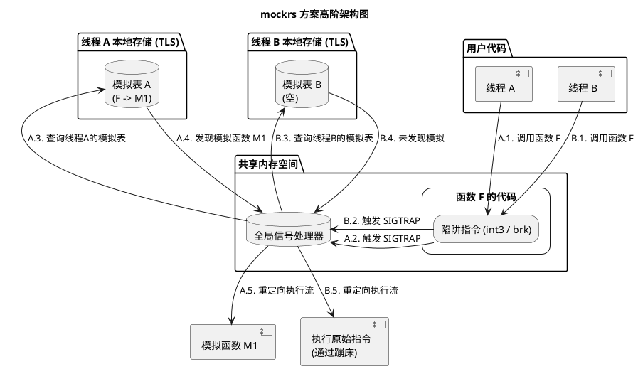
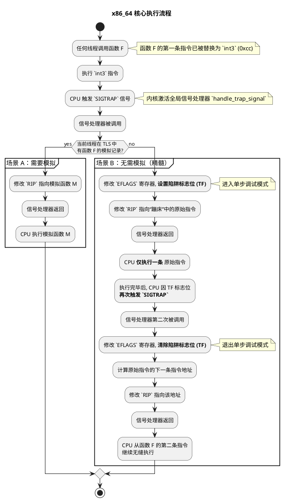
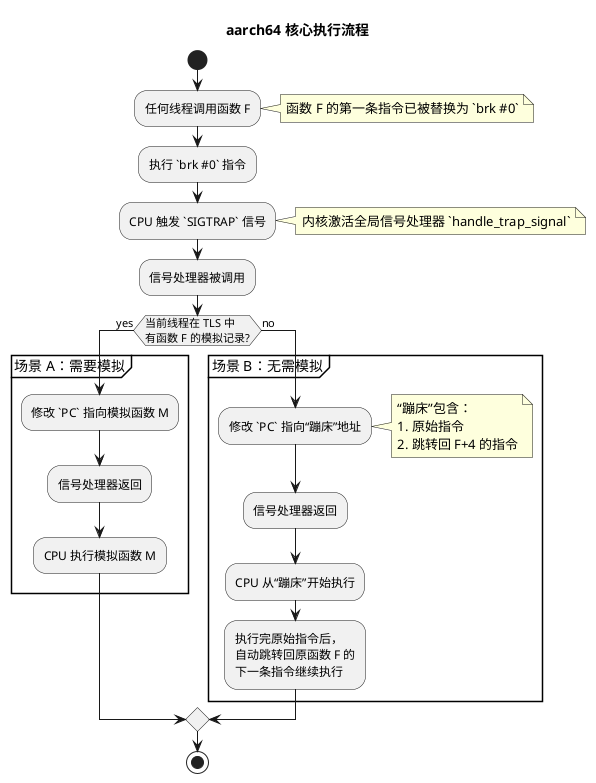

# `mockrs` — 超越 Trait 的自由函数模拟与线程安全

---

## 1. 背景（用户痛点）：突破 Rust 传统模拟的局限

在 Rust 的生态系统中，测试是构建可靠软件的基石。为此，社区开发了许多优秀的模拟（Mocking）库，
例如 `mockall`。这些库功能强大，遵循 Rust 的设计哲学，但它们几乎无一例外地**基于 Trait（接口）进行工作**。
开发者需要先定义一个
Trait，然后为这个 Trait 生成一个模拟实现，并通过依赖注入在测试时使用这个模拟版本。

这种模式在设计良好的应用程序中非常有效，因为它鼓励了面向接口编程。然而，它也带来了无法回避的局限性：

* **无法模拟自由函数**：如果你想模拟一个独立的、不属于任何 Trait 的函数（即自由函数，`fn my_func(...)`），传统模拟库无能为力。
* **无法模拟外部依赖的具体实现**：当你的代码依赖于一个第三方库的某个具体结构体的方法，而这个方法没有通过 Trait 暴露时，你无法对其进行模拟。
* **重构成本高**：为了测试一个简单的函数，你可能需要将其重构为 Trait 的一部分，这增加了不必要的代码复杂性和设计约束。
* **对 FFI 函数束手无策**：当需要模拟与 C/C++ 库交互的 FFI (Foreign Function Interface) 函数时，
  基于 Trait 的方法完全不适用。

**`mockrs` 的诞生，正是为了解决这一核心痛点**。
它提供了一种全新的思路：与其在编译时通过类型系统进行替换，不如在运行时直接深入底层，通过修改函数在内存中的机器码来实现拦截和替换。
这使得 `mockrs` 能够**模拟任何函数**，无论是自由函数、具体方法还是 FFI 函数，彻底摆脱了对 Trait 的依赖。

---

## 2. 需求挖掘（项目目标）

* **任意函数模拟**：在运行时替换**任何**函数，不受 Trait 限制。
* **绝对的线程安全**：模拟操作应仅限于当前线程，不干扰其他线程的正常执行。
* **易用性**：提供简洁的 `mock!` 宏，屏蔽底层复杂性。
* **跨架构支持**：支持 `x86_64` 和 `aarch64` 架构。
* **RAII 设计**：利用 Rust 的 RAII 特性，在模拟对象生命周期结束时自动恢复原始函数。

---

## 3. 核心技术挑战：五个关键问题

实现 `mockrs` 的功能，本质上是回答以下五个环环相扣的底层技术问题：

1. **权限难题**：函数代码通常位于只读内存页中，**如何才能安全地修改它？**
2. **劫持难题**：如何在不破坏原函数逻辑的前提下，“劫持”其执行流？
3. **隔离难题**：劫持是全局性的，**如何才能实现仅对特定线程生效的模拟，而不影响其他线程？** 这是最核心的挑战。
4. **重定位难题**：如果我们将原始指令复制到别处执行，**如何修复其中失效的 PC 相对寻址？**
5. **恢复难题**：对于未被模拟的线程，在执行完原始指令后，**如何让它精确、无缝地返回到原函数的正常执行流程中？**

---

## 4. 解决方案：对五个关键问题的解答

`mockrs` 的解决方案与传统模拟库截然不同，它优雅地结合了底层系统编程和 Rust 的高级特性，逐一解答了上述挑战。

### 解答1 & 2：利用 `mprotect` 和陷阱指令实现安全“劫持”

* **回答权限难题**：我们使用 `nix` 库封装的 `mprotect` 系统调用，在运行时临时将目标函数所在的内存页权限从“只读+执行”修改为“可读+可写+执行”。这使得我们可以安全地写入指令。
* **回答劫持难题**：我们在函数头部写入一条单字节的陷阱指令（x86_64 上的 `int3` 或 aarch64 上的 `brk`）。这条指令会立即中断程序执行流，将控制权交给操作系统，从而实现了“劫持”。同时，我们将被覆盖的原始指令备份到一个我们自己分配的可执行内存区域（称为“蹦床”或“Trunk”），以备后续使用。

下面是挂钩（Hook）建立后，三者在内存中的布局关系示意图：

```text
+--------------------------+         +--------------------------+
|    原函数 (Func F)       |         |   模拟函数 (Func M)      |
| (已被挂钩)               |         | (用户提供)               |
+--------------------------+         +--------------------------+
| 陷阱指令 (int3/brk)      |         |                          |
| (替换了原指令1)          |         | fn mock_logic() { ... }  |
|--------------------------|         |                          |
| 原指令2                  | <---+   | ...                      |
|--------------------------|     |   +--------------------------+
| 原指令3                  |     |
| ...                      |     |
+--------------------------+     |
                                 |
+--------------------------+     |
|    蹦床 (Trampoline)     |     |
| (用于执行原逻辑)         |     |
+--------------------------+     |
| 原指令1 (从Func F复制)   | ----+ (对于未模拟线程, 执行流会跳转到这里)
|--------------------------|
| JUMP 指令                |
| (跳转回"原指令2"的地址)  |
+--------------------------+
```



### 解答3：通过“全局提问、本地回答”实现线程隔离

这是 `mockrs` 设计的精髓，用以回答最核心的**隔离难题**。

#### 解决方案：“全局提问”与“线程本地回答”的精妙设计

`mockrs` 将这个问题分解为两部分：

1. **全局提问（陷阱指令 + 全局信号处理器）**：
    写入函数头部的陷阱指令（如 `int3`）本身不包含任何逻辑。它更像一个全局的“暂停按钮”。一旦任何线程执行到它，就会立刻暂停，并向系统发出一个 `SIGTRAP`
信号，仿佛在问：“执行在这里中断了，接下来该做什么？”。这个问题由一个**全局唯一**的信号处理器来捕获。

2. **线程本地回答（`thread_local!` 宏）**：
    这个问题的“答案”存放在一个使用 Rust 的 `thread_local!` 宏声明的特殊变量中：

    ```rust
    thread_local! {
        static G_THREAD_REPLACE_TABLE: RefCell<HashMap<usize, Vec<usize>>> = RefCell::new(HashMap::new());
    }
    ```

    这是实现线程隔离的**关键**。`thread_local!` 确保了 `G_THREAD_REPLACE_TABLE` **不是一个全局变量**，而是**每个线程都拥有一份完全独立、互不干扰的副本**。

### 解答5：利用信号处理和 CPU 调试状态实现精确恢复

这部分详细阐述了 `mockrs` 如何回答**恢复难题**，其执行流程是一场精妙的底层操作秀。
尤其是在处理一个**未被模拟**的线程调用时，它巧妙地利用了 CPU 自身的调试功能，来确保原始指令被安全、原子地执行。



下面是详细的步骤分解：

#### 第1步：设置钩子 (The Hook)

* 当 `mock!` 宏首次作用于目标函数 `F` 时，`mockrs` 会执行一次性设置。
* 它首先读取函数 `F` 开头的几字节机器码（即第一条指令），并将其完整地复制到一个被称为“蹦床 (Trampoline)”或“Trunk”的专属可执行内存区域。
* 然后，它将函数 `F` 的第一个字节**全局地**替换为 `0xcc`。
  这是 `x86_64` 架构上的 `int3` 指令，一条专门用于触发软件断点的陷阱指令。

#### 第2步：函数调用与陷阱触发

* 此时，**任何线程**对函数 `F` 的调用，都会立即执行 `int3` 指令。
* CPU 捕获到这个陷阱，暂停当前执行流，并向操作系统发出一个 `SIGTRAP` 信号。
* `mockrs` 预先注册的**全局信号处理器** (`handle_trap_signal`) 被内核激活，并接收到当前线程中断时的完整 CPU 上下文（包括所有寄存器的状态）。

#### 第3步：执行路径分发（核心逻辑）

* 信号处理器首先查询当前线程的**线程本地存储 (TLS)**，即 `G_THREAD_REPLACE_TABLE`，以确定如何响应。

* **场景 A：当前线程需要被模拟（简单路径）**
    1. 处理器在 TLS 中找到了为函数 `F` 注册的模拟函数 `M`。
    2. 它直接修改 CPU 上下文中的**指令指针寄存器 (`RIP`)**，使其指向模拟函数 `M` 的地址。
    3. 信号处理器返回。CPU 从新的 `RIP` 地址开始执行，即直接执行了模拟函数 `M`。流程结束。

* **场景 B：当前线程不需要被模拟（精髓所在）**
    1. 处理器在 TLS 中**未**找到函数 `F` 的模拟记录。它必须执行原始指令。
    2. **进入单步调试模式**：处理器修改 CPU 上下文中的 `EFLAGS` 寄存器，**设置其陷阱标志位 (Trap Flag, TF)**。
       这个标志位一旦被设置，CPU 就会进入一种特殊的“单步调试”模式：每成功执行完一条指令，就会自动触发一次 `SIGTRAP` 陷阱。
    3. **执行原始指令**：处理器将指令指针 (`RIP`) 指向“蹦床”内存区中保存的那条原始指令。
    4. 信号处理器返回。CPU 从“蹦床”中**仅仅执行这一条**被备份的原始指令。
    5. **再次触发陷阱**：由于陷阱标志位 (TF) 已被设置，这条指令刚一执行完毕，CPU 立刻**再次触发** `SIGTRAP` 信号，第二次进入我们的信号处理器。
    6. **恢复并返回**：信号处理器第二次被激活。它通过检查 `EFLAGS` 寄存器，发现当前处于单步模式，于是明白这是“执行原始指令后”的返回陷阱。它执行以下恢复操作：
        * 清除 `EFLAGS` 寄存器中的陷阱标志位，**退出单步调试模式**。
        * 计算出原始函数 `F` 中，第一条指令执行完毕后应该继续执行的正确地址（即 `F` 的起始地址 + 原始指令的长度）。
        * 将指令指针 (`RIP`) 设置为这个计算出的返回地址。
    7. 信号处理器返回。CPU 从原始函数 `F` 的第二条指令开始，无缝地继续执行下去。

通过这一套“陷阱 -> 设置调试标志 -> 执行 -> 再陷阱 -> 恢复”的流程，`mockrs` 保证了即使在多线程环境下，对共享函数代码的修改也能够被安全、正确地处理，实现了无懈可击的线程隔离。

### aarch64 架构核心流程

`aarch64` 架构下的实现遵循同样的核心思想，但利用了不同的指令和机制。它不使用CPU的单步调试功能，流程更为直接。

* **陷阱指令**: 使用 `brk #0` 指令替代 `int3`。
* **蹦床 (Trunk)**: 这里的“蹦床”不仅包含原始指令，还紧跟着一条绝对跳转指令，用于在执行完原始指令后，直接跳回到原函数的下一条指令，无需第二次陷阱。



### 解答4：通过指令重写解决重定位难题

这是对**重定位难题**的解答，也是 `mockrs` 实现中最为精细的技术点之一。

**问题**：现代处理器广泛使用 PC 相对寻址（x86_64 中为 RIP 相对寻址），
即指令的操作数是一个相对于当前指令指针（PC/RIP）的偏移量。
例如，一个函数调用 `call near_func` 实际上编码为 `call +offset`。
当我们将这条指令从原始函数位置复制到“蹦床”时，PC 的值变了，
导致原来的偏移量指向了错误的地址，程序会立即崩溃。

**解决方案**：我们必须在复制指令时“修复”它。

1. **识别**：利用 `iced-x86` 或 `capstone` 这样的高级反汇编库，我们可以精确地识别出哪些指令是 PC 相对寻址的。
2. **重写 (Relocation)**：
    * **对于 x86_64**：我们采用一种“寄存器桥接”的策略。首先，找到一个当前指令未使用的
        通用寄存器（例如 `RAX`）。然后，我们将原始指令（如 `mov rax, [rip + 0x1234]`）
        重写为一条或多条指令，这些指令先将计算好的绝对地址加载到我们选定的“桥接寄存器”中，
        然后修改原指令使用这个寄存器进行寻址，从而消除对 RIP 的依赖。
    * **对于 aarch64**：处理方式类似。例如，对于 `ADRP` 这类用于加载页地址的指令，
        我们重新计算它在新位置（蹦床）到目标页的偏移量，并生成一条新的 `ADRP` 指令。
        如果偏移量过大，我们会生成一个更长的指令序列（例如 `LDR` + `B`）来加载完整的绝对地址。
    * **特殊场景：第一条指令就是相对跳转**：这是一个典型的重定位难题。
        例如，一个函数以 `B <label>`（相对分支）或 `BL <sub_function>`（带链接的相对分支）开头。
        当我们将这条指令复制到“蹦床”时，简单的偏移量修复是行不通的。
        * **解决方案**：我们不再复制原始的相对跳转指令。取而代之，我们首先通过反汇编库计算出跳转的
          **绝对目标地址**。然后，在“蹦床”中生成一个全新的**绝对跳转指令序列**。在 aarch64 上，
          这通常是通过 `LDR` 指令将 64 位的绝对地址加载到一个临时寄存器（如 `X17`），
          然后使用 `BR` (无条件分支) 或 `BLR` (带链接的无条件分支) 指令跳转到该寄存器中的地址。
          这个序列完美地模拟了原始跳转的行为，同时完全不受 PC 位置变化的影响。

#### 关键细节：寄存器的安全选择与保护

在“寄存器桥接”策略中，随意选择一个寄存器可能会破坏原函数的执行逻辑（例如，覆盖了某个重要的中间计算结果）。`mockrs` 通过一套严谨的机制保证了操作的安全性：

* **智能选择**：在重写指令时，`mockrs` 会分析原指令用到的所有寄存器，并从一个预设的通用寄存器列表（如 `RAX`, `RBX`, `RCX`...）中，**选择一个原指令完全没有使用的寄存器**作为“桥接寄存器”。这从源头上避免了冲突。
* **上下文保护**：尽管我们选择了“空闲”寄存器，但无法保证它在函数调用时没有被调用者用于传递参数或存储其他数据。因此，在信号处理器中，执行蹦床指令**之前**，我们会先将这个“桥接寄存器”的当前值备份下来；在蹦床指令执行完毕并再次触发陷阱**之后**，再将备份的值恢复回去。

这套“智能选择 + 上下文保护”的组合拳，确保了 `mockrs` 对寄存器的使用是完全透明且无副作用的，不会干扰到函数的正常执行流程。

这个过程确保了即使指令被移动，它依然能正确地访问到它原本要访问的数据和函数，这是 `mockrs` 能够稳定运行的基石。

### 核心技术栈

* **`nix`**: 用于处理 POSIX 系统调用。
* **`lazy_static`**: 用于安全地初始化全局静态数据。
* **`iced-x86`** (`x86_64`) 和 **`capstone`** (`aarch64`): 用于精确地反汇编和编码机器指令。

---

## 5. 实现效果

`mockrs` 的实现带来了革命性的效果：

* **通用性**：真正实现了“万物皆可模拟”，为 Rust 测试提供了前所未有的灵活性。
* **低侵入性**：无需为了可测试性而修改生产代码的设计（如引入不必要的 Trait）。
* **接口简洁**：`mock!` 宏屏蔽了所有底层复杂性，使用体验极为简单。
* **并发安全**：精巧的线程隔离设计，让编写并行测试信心十足，无惧状态污染。

`mockrs` 通过深入底层，解决了 Rust 主流模拟方案的固有局限性，并以一种极为优雅的方式攻克了线程隔离的难题，为那些传统方法难以触及的测试场景提供了一个强大而可靠的解决方案。

---

## 6. 局限性与未来展望

`mockrs` 是一个强大的工具，但和其他基于运行时挂钩的方案一样，它也有其适用边界和待探索的未来方向。

### 当前局限性

* **性能开销**：每一次被挂钩的函数调用（无论是否被模拟）都会触发一次`SIGTRAP`信号，
  这涉及从用户态到内核态再返回的切换，其开销远高于常规的函数调用。
  因此，`mockrs` 不适用于对性能极度敏感的热点路径进行模拟。
  它更适合用于集成测试和功能测试，而非性能基准测试。
* **无法模拟内联函数**：`mockrs` 通过替换函数入口的机器码来工作。
  如果一个函数在编译时被编译器完全**内联（inlined）**，它就不再有独立的函数体和入口地址，`mockrs` 自然也就无法找到并挂钩它。
* **非常短的函数**：挂钩需要在函数头部写入一条陷阱指令（`int3` 为 1 字节，`brk` 为 4 字节）。如果一个函数的总长度小于这条指令，或者其第一条指令与后续指令紧密耦合无法被安全替换，那么挂钩可能会失败。这种情况在实践中极为罕见。

### 未来展望

* **性能优化**：探索更高效的“蹦床”技术，例如在首次无需模拟的调用后，动态地将原始指令写回，减少后续调用的陷阱开销。
* **更广泛的平台支持**：将 `mockrs` 的能力扩展到更多的 CPU 架构和操作系统，如 32 位系统或 Windows。
* **更强大的 API**：提供更丰富的 API，例如支持查看函数调用次数、参数捕获等 `mockall` 库所具备的高级模拟功能。
