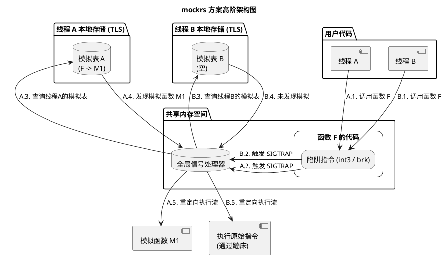
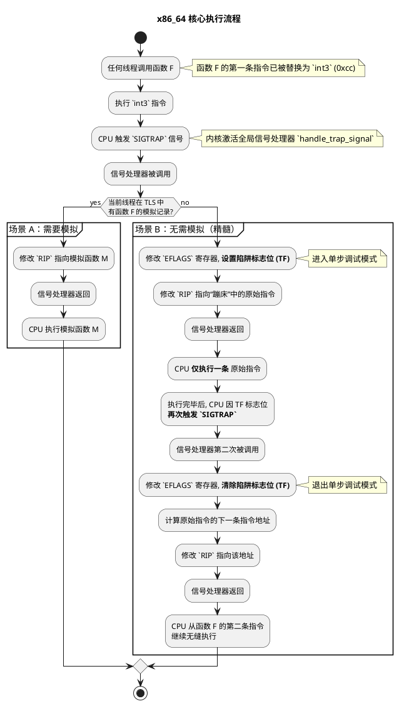
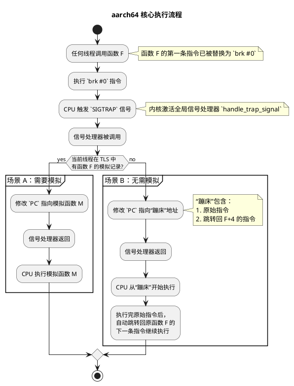

# `mockrs` — 超越 Trait 的自由函数模拟与线程安全

摘要

mockrs 通过在运行时修改函数入口机器码并结合信号处理与线程本地存储（TLS），实现对任意函数（自由函数、具体方法、FFI 函数）的精确模拟，并在多线程环境中提供严格的线程隔离。相较传统基于 Trait 的模拟库，mockrs 不需要对生产代码进行接口化重构，适合集成测试与复杂边界场景。本文系统阐述问题背景、设计目标、架构与关键方案、实现细节、跨架构差异、工程化与测试、效果评估以及局限与展望。

---

## 1. 引言

1.1 背景与动机

在 Rust 生态中，测试是构建可靠软件的基石。传统模拟库（如 mockall）功能强大，但几乎都基于 Trait 工作：开发者需要先定义 Trait，再生成模拟实现并通过依赖注入在测试时使用。这一模式鼓励面向接口编程，但也带来如下局限：
- 无法模拟自由函数（fn my_func(...)）
- 无法模拟外部依赖的具体实现（未通过 Trait 暴露）
- 为可测试性引入不必要的设计约束（重构成本高）
- 难以处理 FFI 函数

1.2 问题陈述

目标是在不修改被测代码设计的前提下，能够在运行时对任意函数进行拦截与替换；并且在多线程场景中，确保仅对指定线程生效，其他线程无感。

1.3 目标与非目标

- 目标：
  - 任意函数模拟（自由函数、具体方法、FFI）
  - 线程隔离（仅影响当前线程）
  - 易用性（提供 mock! 宏）
  - 跨架构支持（x86_64 与 aarch64）
  - RAII（作用域结束自动恢复）
- 非目标：
  - 性能极致优化的热点路径替换（每次调用都会引发信号）

---

## 2. 设计概览

2.1 核心思路

mockrs 不在类型系统层面做替换，而是在运行时直接对函数入口的机器码做最小篡改：将第一条指令替换为陷阱指令（x86_64 上的 int3，aarch64 上的 brk）。任何线程执行到此处都会触发 SIGTRAP，由全局信号处理器接管执行流；随后根据“线程本地模拟表（TLS）”决定是跳转到模拟函数，还是执行被备份到“蹦床（Trampoline/Trunk）”中的原始指令并精确恢复。

2.2 顶层模型

- 全局提问：陷阱指令 + 全局信号处理器捕捉 SIGTRAP
- 线程本地回答：TLS 中的 G_THREAD_REPLACE_TABLE 决定本线程是否模拟以及跳转目标
- 蹦床：备份原始指令（必要时重写以修复 PC 相对寻址），并在必要时带跳回序列
- RAII：Mocker 生命周期结束时撤销当前线程的模拟记录

2.3 设计原则

- 最小侵入：仅修改函数入口处字节
- 可证恢复：未模拟线程路径具备确定性和可验证的恢复流程
- 架构适配：针对 x86_64 与 aarch64 的指令集特性分别采用最稳健机制
- 工程可用：提供 CI 与 aarch64 交叉测试保障

---

## 3. 架构与执行流程

3.1 高阶架构图

3.2 线程隔离的核心

- TLS（thread_local!）为每个线程提供独立的 G_THREAD_REPLACE_TABLE：RefCell<HashMap<usize, Vec<usize>>>
- RAII 模式支持嵌套 mock：每线程对同一函数可形成“模拟栈”
- 全局状态最小化：仅维护 G_TRUNK_ADDR_TABLE: Mutex<HashMap<usize, usize>>

3.3 设计考虑（线程隔离）

- 线程本地存储（TLS）优先：避免锁竞争与伪共享
- RAII 与嵌套支持：Mocker Drop 时在本线程出栈并清理
- 信号处理器无锁与可重入：仅读 TLS，原子式寄存器调整
- 失败隔离：未模拟线程透明走“蹦床 + 恢复”路径

---

## 4. 关键挑战与解决方案

我们面临五个关键问题：权限（可写）、劫持（拦截执行流）、隔离（线程粒度生效）、重定位（PC 相对修复）、恢复（精确跳回）。以下给出整体解法。

4.1 权限与劫持：mprotect + 陷阱指令

- 使用 nix::mprotect 在运行时将目标页权限临时改为 RWX
- 在函数入口写入陷阱指令（x86_64 上的 int3，aarch64 上的 brk）
- 将被覆盖的第一条原始指令备份到“蹦床”

4.2 执行路径分发与线程隔离

- 全局信号处理器根据 TLS 判定：有模拟则重定向至新函数，无则执行蹦床中的原始指令

4.3 精确恢复（x86_64 单步；aarch64 一次跳回）

- x86_64：设置 EFLAGS.TF 进入单步模式，仅执行蹦床中一条重写指令，第二次 SIGTRAP 负责清除 TF、恢复寄存器并跳回 orig+len
- aarch64：不使用单步；蹦床包含“原始/重写指令 + 绝对跳回”，一次 SIGTRAP 即引导并返回

4.4 重定位（指令重写）

- x86_64：iced-x86 识别 RIP 相对寻址，挑选未使用的 caller-saved 寄存器作为“桥接寄存器”；在信号处理器中临时写入 next_ip 并执行重写后的指令
- aarch64：对 B/BL 等分支生成“LDR X17, #8; BR/BLR X17; <绝对地址>”；对 ADRP/ADR 在蹦床 PC 重编码或回退到“字面量装载 + 跳转/使用”；必要时对 literal LDR 采用保守序列避免 SIGILL

---

## 5. 平台差异与原因

5.1 x86_64 与 aarch64 的差异（概览）

- 入口陷阱：int3（1B） vs brk（4B）
- 未模拟路径：x86_64 两次 SIGTRAP 的单步恢复 vs aarch64 一次 SIGTRAP 的直接跳回
- 蹦床组织：x86_64 变长指令 + 3B 头；aarch64 4B 对齐 + 跳回序列 + 字面量地址
- 指令重写：寄存器桥接 vs 绝对地址序列/重编码
- 临时寄存器：动态选择 caller-saved vs 固定 X17
- I-Cache：通常无需显式刷新 vs 需要 dsb sy + ic ivau + isb
- 性能形态：精确单步（两次陷阱） vs 确定性跳回（一次陷阱）
- 兼容性：x86_64 倚重成熟单步；aarch64 强调对齐与缓存维护的保守策略

5.2 原因分析

- ISA 差异导致断点指令长度、PC 相对编码与重写成本不同
- x86 I/D cache 一致性由硬件保障；ARM 对自修改代码要求显式缓存维护
- 平台约定（如 X17 用作跳转寄存器）与 ABI 差异影响临时寄存器选择
- 调试能力差异决定了单步/跳回的可移植性与稳健性

---

## 6. 执行流程细化

6.1 x86_64 核心执行流程

6.2 aarch64 核心执行流程

---

## 7. 实现细节

7.1 关键数据结构

- 全局蹦床地址表：G_TRUNK_ADDR_TABLE: Mutex<HashMap<usize, usize>>（原函数入口 -> 蹦床地址）
- 线程本地模拟表：G_THREAD_REPLACE_TABLE: thread_local RefCell<HashMap<usize, Vec<usize>>>（原函数 -> 模拟函数栈）
- 作用域恢复：Mocker 的 Drop 在本线程内出栈并清理

7.2 代码区与内存管理

- 通过 mmap 分配可读/写/执行的“代码区”作为蹦床区域
- 默认容量：8 页（PAGE_SIZE=4096），可通过环境变量 MOCKRS_CODE_AREA_SIZE_IN_PAGE 调整
- Droper 的 Drop 在进程退出时 munmap 回收

7.3 内存权限

- 写入函数入口或蹦床时，使用 mprotect 临时修改目标页权限为 RWX
- aarch64 场景下，每次写入后执行 dsb sy + ic ivau + isb 刷新指令缓存

7.4 蹦床格式

- x86_64：3 字节头（old_len/new_len/replace_reg）+ 重写后的单条指令；指令变长，无固定对齐
- aarch64：3 字节头 + 4 字节对齐填充 + 重写指令序列 + 跳回指令 + 8 字节字面量地址

7.5 指令重写策略

- x86_64：iced-x86 解析 RIP 相对寻址，动态选择 caller-saved 寄存器作为桥接，信号路径内负责寄存器保存/恢复
- aarch64：对分支/PC 相对指令进行重编码或使用“LDR X17 + BR/BLR + 字面量地址”的保守序列；在仿真环境下优先稳健方案避免 SIGILL

7.6 核心技术栈

- nix：封装 POSIX 系统调用
- lazy_static：安全初始化全局静态数据
- iced-x86（x86_64）与 capstone（aarch64）：反汇编与编码机器指令

---

## 8. 工程化与测试

- CI 跨架构验证：仓库提供 GitHub Actions 工作流，除常规 x86_64 编译/测试外，还通过 qemu-user-static 在 Ubuntu 上透明执行 aarch64 目标二进制，并使用 aarch64-linux-gnu 工具链进行交叉编译与链接。关键步骤：
  - 安装 qemu-user-static 和 binfmt-support，并启用 qemu-aarch64
  - 安装 aarch64 交叉工具链与运行时依赖（gcc-aarch64-linux-gnu、libc6-dev-arm64-cross、libc6:arm64 等）
  - 安装 Rust 工具链并添加 aarch64-unknown-linux-gnu 目标
  - 设置环境变量：
    - CARGO_TARGET_AARCH64_UNKNOWN_LINUX_GNU_LINKER=aarch64-linux-gnu-gcc
    - QEMU_LD_PREFIX=/usr/aarch64-linux-gnu
  - 分别执行 cargo build/test --target aarch64-unknown-linux-gnu

- 本地运行 aarch64 测试：在开发机上同样可通过上面的工具链与环境变量，借助 QEMU 用户态仿真透明运行 aarch64 目标的测试。

---

## 9. 效果评估

- 通用性：实现“万物皆可模拟”，覆盖自由函数、具体方法与 FFI 场景
- 低侵入性：无需为测试重构生产代码（如强行引入 Trait）
- 接口简洁：mock! 宏屏蔽底层复杂度
- 并发安全：线程隔离设计可支撑并行测试而不发生状态污染

---

## 10. 局限性与未来展望

10.1 当前局限性

- 性能开销：每次调用都会触发 SIGTRAP，开销高于常规调用；不适合性能极致场景
- 无法模拟被完全内联的函数：编译器内联后缺失独立入口，无法挂钩
- 极短函数/特殊布局：若入口替换不安全，则可能失败（实践中罕见）

10.2 未来展望

- 性能优化：探索更高效的蹦床技术（如按需写回，减少后续陷阱）
- 更广平台：扩展到更多 CPU 架构与系统（含 32 位与 Windows）
- 更强 API：如调用次数统计、参数捕获等高级能力

---

## 11. 安全与合规说明

- 代码区与目标页以 RWX 方式写入，适用于测试与开发环境；生产环境需充分评估风险与合规性
- aarch64 下自修改代码需严格执行 I-Cache 刷新序列

---

## 12. 结论

mockrs 以“全局提问、线程本地回答”为核心思想，通过最小侵入的入口陷阱与稳健的架构适配，解决了传统基于 Trait 的模拟方案无法触及的自由函数/FFI 等场景，并在多线程条件下提供可证的隔离与恢复能力。该方案为 Rust 的复杂测试需求提供了强大而务实的工具基础。
